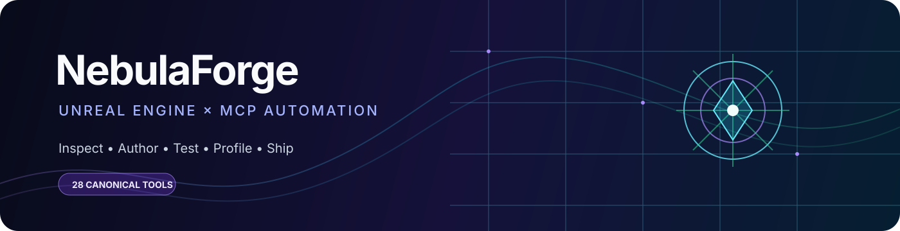

# NebulaForge

### The AI control plane for Unreal Engine

Turn natural-language intent into validated Unreal Editor work: inspect, author, simulate, test, profile, package, and iterate.

  <a href="#-start-here"><strong>Start here</strong></a> ·
  <a href="#-what-you-can-build"><strong>Explore capabilities</strong></a> ·
  <a href="docs/production-capability-audit.md"><strong>See the production audit</strong></a> ·
  <a href="https://github.com/ADH36/NebulaForge/discussions"><strong>Join the community</strong></a>

---

## ✦ Start here

| 🟣 **Native MCP** | 🔵 **TypeScript bridge** |
|:---:|:---:|
| Direct HTTP + SSE inside Unreal | stdio + WebSocket for clients and CI |
| No Node.js or npm required | Node.js 18+ |
| Best for the fastest local setup | Best for host-side workflows |
| <code>http://127.0.0.1:3000/mcp</code> | <code>node dist/cli.js</code> |

<strong>⚡ Fastest setup — Native MCP</strong>

1. Copy or link <code>plugins/NebulaForgeBridge</code> into your Unreal project.
2. Enable <strong>Native MCP</strong> in <strong>Edit → Project Settings → Plugins → NebulaForge Bridge</strong>.
3. Restart the editor.
4. Connect your MCP client to <code>http://127.0.0.1:3000/mcp</code>.

Claude Code:

~~~bash
claude mcp add unreal-engine --transport http http://127.0.0.1:3000/mcp
~~~

Cursor, in <code>.cursor/mcp.json</code>:

~~~json
{
  "mcpServers": {
    "unreal-engine": {
      "url": "http://127.0.0.1:3000/mcp"
    }
  }
}
~~~

Look for the MCP indicator in the Unreal status bar. The <code>LogMcpNativeTransport</code> category shows sessions, calls, progress, and failures.

<strong>🛠 Flexible setup — TypeScript bridge</strong>

Install and run from npm:

~~~bash
npx unreal-nebula-forge-mcp-server
~~~

Or clone and build:

~~~bash
git clone https://github.com/ADH36/NebulaForge.git
cd NebulaForge
npm install
npm run build:core
node dist/cli.js
~~~

Example client configuration:

~~~json
{
  "mcpServers": {
    "unreal-engine": {
      "command": "node",
      "args": ["C:/Path/To/NebulaForge/dist/cli.js"],
      "env": {
        "UE_PROJECT_PATH": "C:/Path/To/YourProject",
        "MCP_AUTOMATION_HOST": "127.0.0.1",
        "MCP_AUTOMATION_PORT": "8091"
      }
    }
  }
}
~~~

<strong>📦 Install the Unreal plugin</strong>

For a source build, copy the plugin into your project:

~~~text
NebulaForge/plugins/NebulaForgeBridge/
  → YourProject/Plugins/NebulaForgeBridge/
~~~

A project with a C++ code target is required for source compilation. Blueprint-only projects can use a pre-built package:

~~~bash
# macOS / Linux
./scripts/package-plugin.sh /path/to/UE_5.6

# Windows
scripts\package-plugin.bat C:\Path\To\UE_5.6
~~~

Unzip the result into <code>YourProject/Plugins/</code>. Plugin binaries are tied to the Unreal Engine version used to build them.

---

## ◈ What you can build

NebulaForge is organized around outcomes, not isolated engine APIs.

<table>
<tr>
<td width="50%" valign="top">

### 🌌 Worlds and content

- Landscapes, erosion, foliage, water, sky, clouds, weather, wind, time of day
- Levels, sublevels, World Partition, data layers, HLOD, streaming, volumes
- PCG graphs, subgraphs, nodes, pin connections, settings, execution
- Procedural meshes, splines, roads, rivers, fences, navigation bounds
- Materials, functions, instances, render targets, textures, physical materials
- Data Assets, Primary Assets, DataTables, CurveTables, media, imports, metadata

</td>
<td width="50%" valign="top">

### 🧬 Gameplay and AI

- Blueprints, CDOs, SCS templates, graphs, pins, variables, widgets, bindings
- Actors, components, transforms, cameras, view targets, physics, collision, tags
- GAS abilities/effects/attributes, combat, weapons, projectiles, damage
- Character movement, locomotion, inventory, equipment, loot, crafting, interaction
- Behavior Trees, decorators, services, blackboards, EQS, State Trees
- Smart Objects, perception, navigation, Gameplay Debugger, online sessions

</td>
</tr>
<tr>
<td width="50%" valign="top">

### 🎥 Simulation and presentation

- PIE sessions, packaged launches, runtime inspection, simulated input
- Niagara systems, emitters, GPU effects, debug shapes, VFX budget validation
- Animation Blueprints, skeletons, montages, physics assets, cloth, vehicles
- Control Rig, IK Rig, Sequencer, camera cuts, tracks, keyframes, metadata
- Movie Render Queue jobs with bounded resolution, frame ranges, polling, cancellation
- Sound Cues, MetaSounds, source effects, attenuation, media, Take Recorder, replays

</td>
<td width="50%" valign="top">

### 🚦 Test, profile, and ship

- Automation and functional tests with managed results and completion events
- Blueprint, map, project, asset, animation, Niagara, and plugin validation
- Unreal Insights, memory reports, stat commands, network profiler, Visual Logger
- UAT BuildCookRun, compression, encrypted INI/PAK options, signing controls
- Win64, Linux, Mac staging; Android ADB and iOS/tvOS simulator deployment
- Release gates, required files, project manifests, plugin checks, SHA-256 archives

</td>
</tr>
</table>

<strong>✨ Recent capability additions</strong>

- Transactional DataTable row modification and deletion with reflected-property validation and optional safe saves.
- Managed asynchronous PCG generation with timeout, cancellation, completion events, and polling.
- Local desktop staging plus Android ADB and iOS/tvOS simulator deployment when prerequisites exist.
- Release gates combining project/plugin checks, archive manifests, hashes, and optional Unreal tests.
- Trace, memory, network-profiler, stat, and Visual Logger capture workflows.
- Media playback, Take Recorder lifecycle, replay controls, online identity/presence, and network-condition testing.

---

## ◎ See the system

~~~mermaid
flowchart LR
    User[AI assistant] --> Choice{MCP transport}
    Choice -->|Native| HTTP[HTTP + SSE]
    Choice -->|TypeScript| STDIO[stdio + WebSocket]
    HTTP --> Bridge[NebulaForge Bridge]
    STDIO --> Bridge
    Bridge --> Editor[Unreal Editor]
    Editor --> Author[Assets and worlds]
    Editor --> Play[PIE and runtime verification]
    Editor --> Ship[Tests, profiling, packaging]
~~~

### Safety and reliability, built in

| Boundary | Protection |
|---|---|
| Network | Loopback-first binding; non-loopback access requires explicit opt-in |
| Authentication | Optional capability token for native HTTP and WebSocket handshakes |
| Paths | Confined Unreal roots and normalized project-relative paths |
| Commands | Dangerous console commands rejected by validation rules |
| Long work | Bounded timeouts, progress, cancellation, managed IDs, and terminal results |
| Responses | Structured schemas, explicit errors, redacted logs, and output limits |
| Editor safety | Game-thread dispatch and project save/load safety wrappers |

The TypeScript host owns MCP registration, schemas, validation, connection policy, request tracking, logs, and host workflows. The C++ plugin owns Unreal operations, native transport, game-thread execution, and engine compatibility.

---

## ⌘ The tool surface

28 canonical parent tools keep the MCP context compact while exposing hundreds of focused actions.

<table>
<tr>
<td width="25%" valign="top">

<strong>CORE</strong>

<code>manage_asset</code> 
<code>manage_blueprint</code> 
<code>control_actor</code> 
<code>control_editor</code> 
<code>manage_level</code> 
<code>system_control</code> 
<code>inspect</code> 
<code>manage_tools</code>

</td>
<td width="25%" valign="top">

<strong>WORLD</strong>

<code>build_environment</code> 
<code>manage_level_structure</code> 
<code>manage_geometry</code> 
<code>manage_pcg</code>

</td>
<td width="25%" valign="top">

<strong>GAMEPLAY</strong>

<code>animation_physics</code> 
<code>manage_effect</code> 
<code>manage_gas</code> 
<code>manage_character</code> 
<code>manage_combat</code> 
<code>manage_ai</code> 
<code>manage_inventory</code> 
<code>manage_interaction</code>

</td>
<td width="25%" valign="top">

<strong>UTILITY</strong>

<code>manage_audio</code> 
<code>manage_sequence</code> 
<code>manage_networking</code>
</td>
</tr>
</table>

<strong>Example action families</strong>

| Parent tool | Example actions |
|---|---|
| <code>manage_asset</code> | create_data_table, modify_data_table_row, delete_data_table_row, create_material, create_media_player, import_curve_table_csv |
| <code>manage_blueprint</code> | create, add_node, connect_pins, add_component, compile, inspect_cdo |
| <code>system_control</code> | run_uat, release_gate, run_tests, execute_python, capture_insights_trace |
| <code>manage_pcg</code> | create_graph, add_node, connect_pins, configure_node, execute |
| <code>manage_networking</code> | get_online_identity_status, configure_network_conditions, run_network_soak |

Use <code>inspect → production_capabilities</code> to discover what is available for the current engine, project, and plugin set.

---

## ⟳ Production loop

~~~mermaid
flowchart TD
    A[Describe intent] --> B[Inspect capabilities]
    B --> C[Author content]
    C --> D[Validate and save]
    D --> E{Verify}
    E -->|PIE| F[Gameplay checks]
    E -->|Tests| G[Automation results]
    E -->|Profile| H[Insights capture]
    F --> I[Package or stage]
    G --> I
    H --> I
    I --> J[Release gate]
~~~

| Workflow | Typical sequence |
|---|---|
| World building | Level → landscape/foliage/water → PCG → navigation → inspect → save |
| Gameplay authoring | Blueprint → components/graphs → input/GAS → compile → PIE → validate |
| Content validation | Asset/project checks → Data Validation → map check → automation tests |
| Performance | Trace session → Insights/memory/network capture → bounded analysis |
| Release | Plugin/project manifest → UAT package → stage/deploy → release gate |
| Online testing | Provider capabilities → session lifecycle → network conditions → soak result |

---

## ⚙ Configuration

### TypeScript bridge

~~~env
UE_PROJECT_PATH=C:/Path/To/YourProject
MCP_AUTOMATION_HOST=127.0.0.1
MCP_AUTOMATION_PORT=8091
MCP_AUTOMATION_ALLOW_NON_LOOPBACK=false
LOG_LEVEL=info
MCP_CONNECTION_TIMEOUT_MS=5000
MCP_REQUEST_TIMEOUT_MS=120000
ASSET_LIST_TTL_MS=10000
~~~

Optional metrics:

~~~env
MCP_METRICS_PORT=9100
MCP_METRICS_HOST=127.0.0.1
MCP_METRICS_ALLOW_NON_LOOPBACK=false
MCP_METRICS_TOKEN=change-me
~~~

LAN mode must be explicitly enabled and protected with a capability token. Treat non-loopback access as privileged network access.

### Unreal plugin prerequisites

Enable core dependencies in <strong>Edit → Plugins</strong>. Optional capabilities activate when their Unreal modules are available:

| Area | Relevant plugins |
|---|---|
| Effects and media | Niagara, Niagara Editor, Media Framework |
| World building | PCG, Water, Geometry Script, Procedural Mesh Component |
| Animation | Control Rig, IK Rig, RigVM, Chaos Cloth |
| AI | Behavior Tree Editor, Environment Query Editor, StateTree, Smart Objects |
| Gameplay | Gameplay Abilities, Enhanced Input, Gameplay Debugger |
| Audio and capture | MetaSound, Synthesis, Take Recorder |
| Validation and content | Data Validation, Interchange |
| Online | OnlineSubsystem, OnlineSubsystemUtils |

Unavailable optional plugins return explicit capability or action errors.

---

## 🐳 Docker

Use Docker for the TypeScript host when the Unreal bridge is reachable from the container:

~~~bash
docker build -t unreal-nebula-forge .
docker run --rm -it -e UE_PROJECT_PATH=/project unreal-nebula-forge
~~~

Native MCP does not need Docker or Node.js; it runs inside the Unreal Editor plugin.

---

## 🧭 Documentation map

| Need | Open |
|---|---|
| Know what is truly production-ready | [Production capability audit](docs/production-capability-audit.md) |
| Understand planned work | [Roadmap](docs/Roadmap.md) |
| Trace TypeScript to native handlers | [Handler mappings](docs/handler-mapping.md) |
| Extend the C++ plugin | [Plugin extension guide](docs/editor-plugin-extension.md) |
| Run tests and audits | [Testing guide](docs/testing-guide.md) |
| Check UE 5.8 support | [Compatibility matrix](docs/ue5.8-compatibility-matrix.md) |
| Follow native MCP progress | [Native automation progress](docs/native-automation-progress.md) |
| Review releases | [Changelog](CHANGELOG.md) |

---

## 🧪 Development

~~~bash
npm install
npm run build:core
npm run type-check
npm run lint
npm run test:unit
npm run test:smoke
npm run test:native-parity
npm run test:params
npm test
~~~

Useful project commands:

- <code>npm run automation:sync</code> — synchronize the bridge plugin into a target project
- <code>npm run clean:tmp</code> — safely clean repository temporary artifacts
- <code>npm run build:watch</code> — watch TypeScript changes

---

## 🩺 Troubleshooting

<strong>The client cannot connect</strong>

Confirm the plugin is enabled, the editor is running, and the port matches the transport: <code>3000</code> for Native MCP or <code>8091</code> for the WebSocket bridge.

<strong>Unreal reports Missing Modules</strong>

Build the project target through Visual Studio or Xcode, then reopen the editor. Runtime compilation is not available for every project configuration.

<strong>An action is unavailable</strong>

Check optional plugin availability and inspect <code>production_capabilities</code>. Native MCP may load only core tools until another category is enabled through <code>manage_tools</code>.

<strong>An asset is not found immediately after creation</strong>

Unreal asset discovery can depend on editor rescan timing. Retry after the operation completes or use the returned package/object path.

---

### Build worlds at the speed of conversation.

MIT — see [LICENSE](LICENSE).

